# WrtPilot screenshots

Taken automatically from `634eb49` against the mock router (tools/mock-router).

### 01-welcome

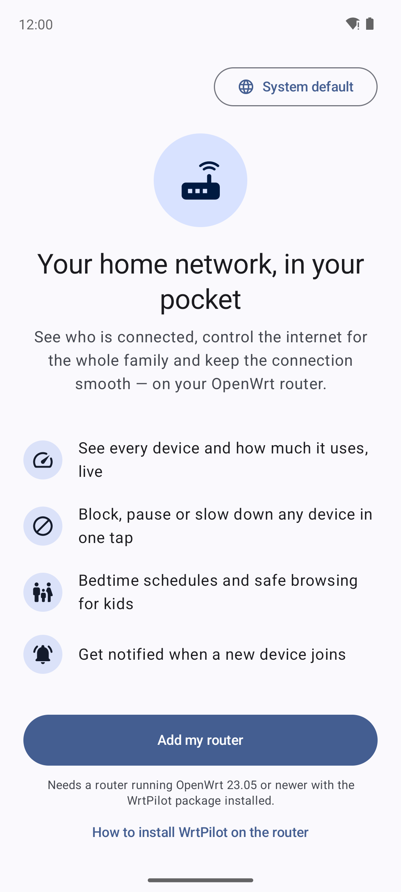

### 02-add-router

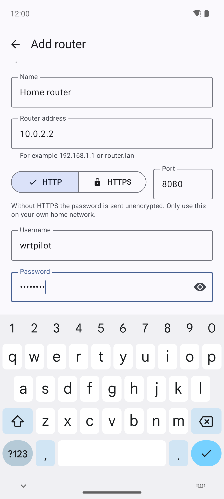

### 03-router-check

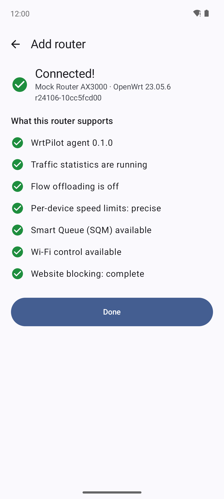

### 04-home

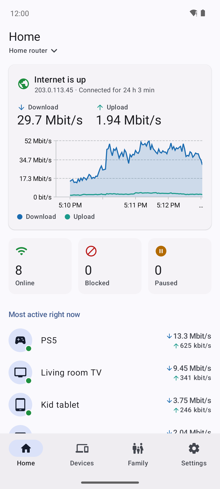

### 05-devices

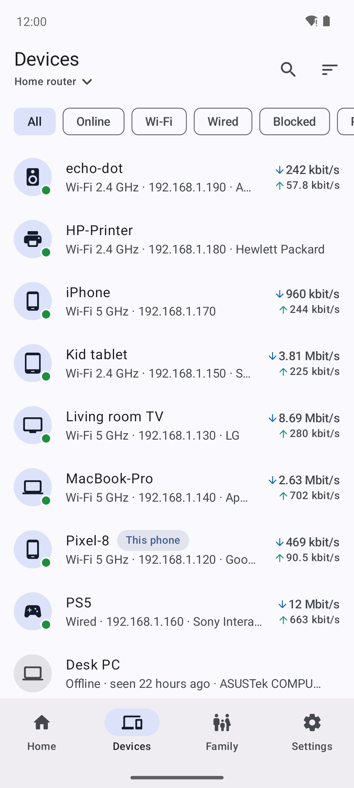

### 06-device-detail

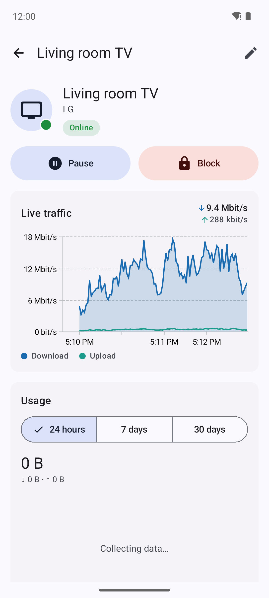

### 07-family

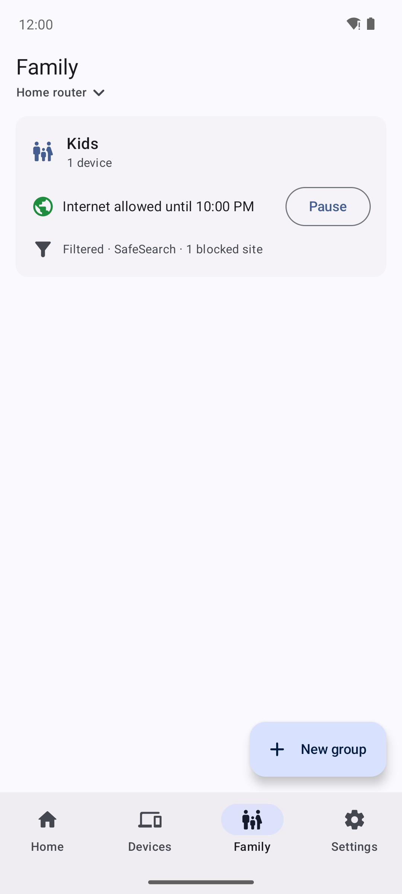

### 08-family-group

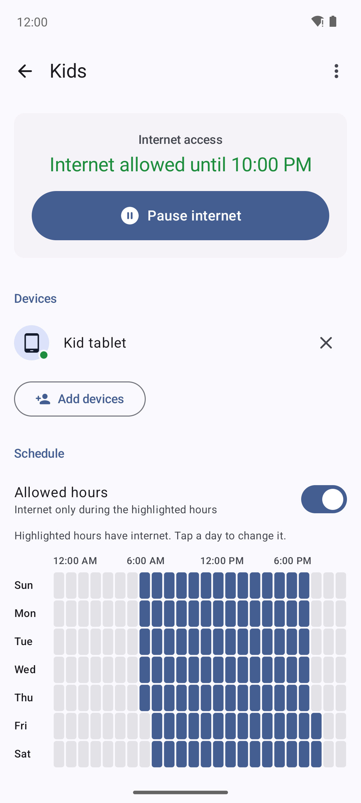

### 09-settings

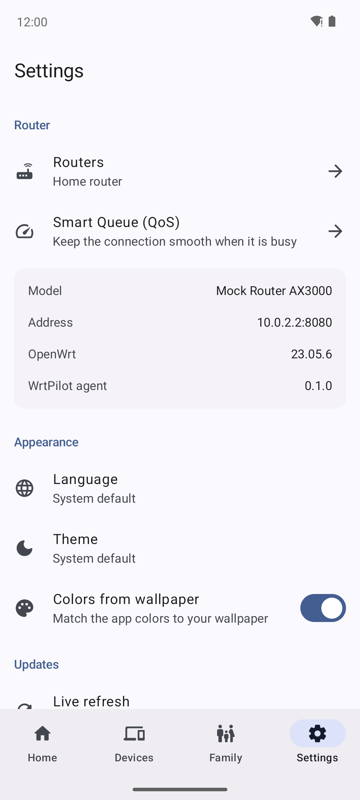

### 10-smart-queue

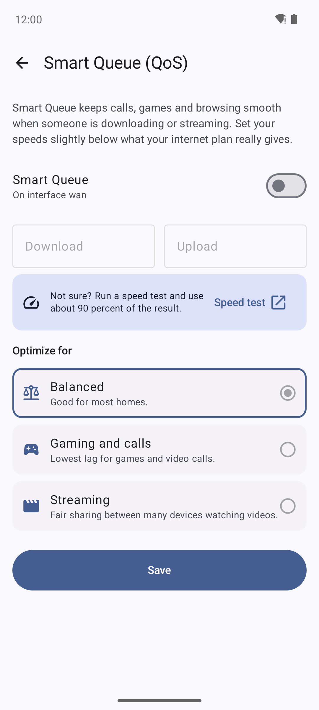

### 11-home-dark

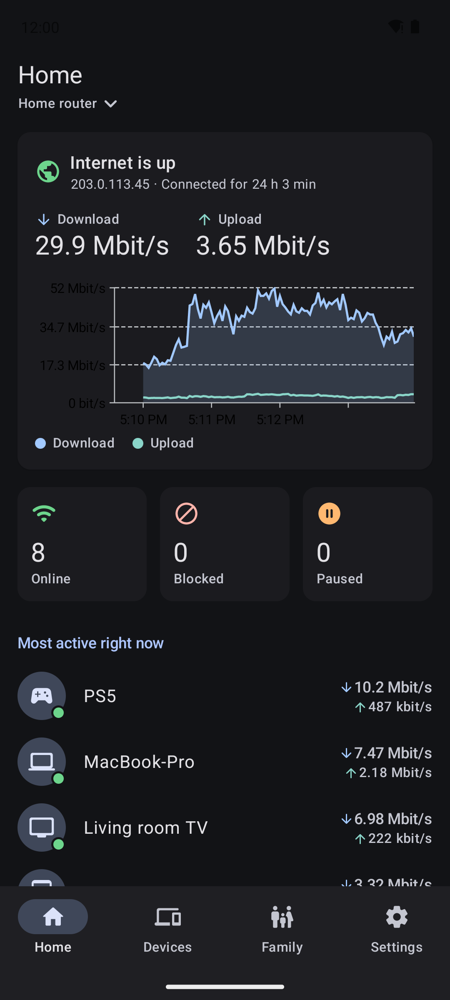

### 12-device-detail-dark

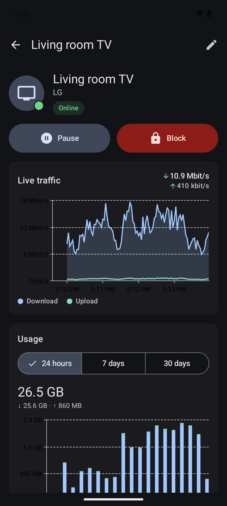

### 13-home-arabic

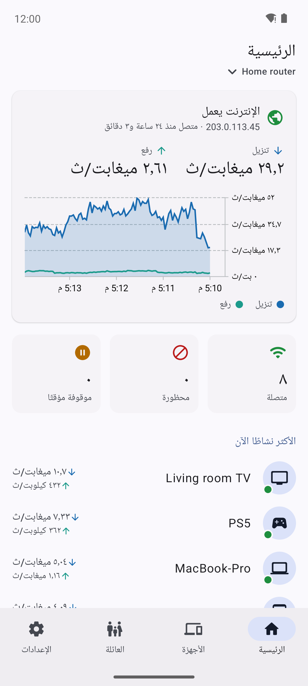

### 14-devices-arabic

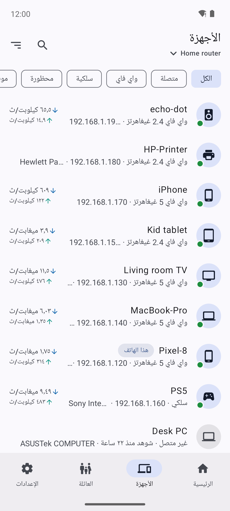

### 15-device-detail-arabic

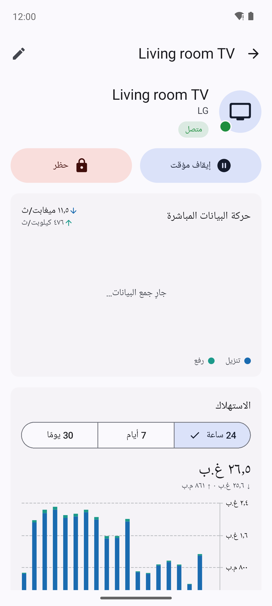

### 16-family-group-arabic

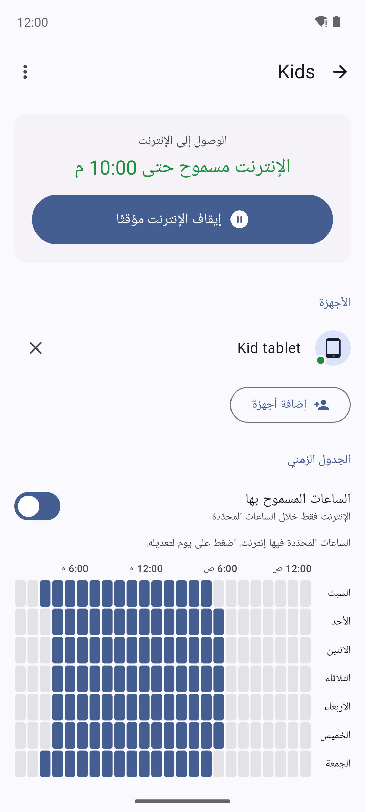

### 17-home-french

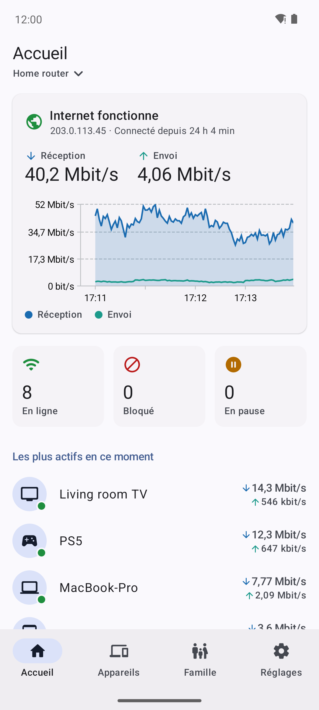

